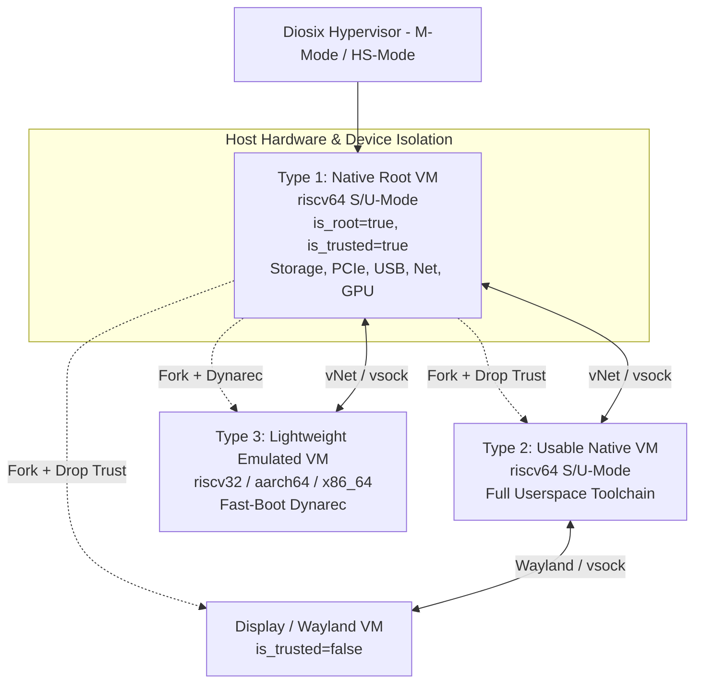
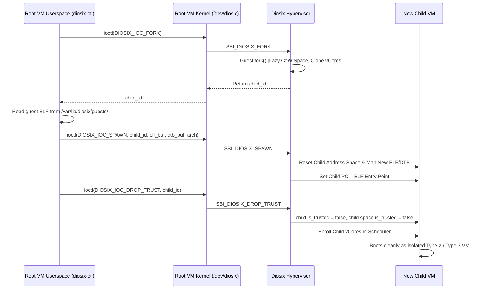

# Diosix Guest Virtualization & Multi-VM Architecture: Technical Plan

This technical plan defines the design, build system orchestration, communication subsystem, and provisioning lifecycle for multi-VM guest execution under the **Diosix Hypervisor**.

---

## 1. Architectural Overview

Diosix implements a microkernel-inspired hypervisor architecture featuring a **hierarchical privilege model**:



### Core Security & Privilege Principles
1. **The Hypervisor (M/HS-Mode)**: Small, secure, and isolated. Manages CPU scheduling, Stage-2 page tables, Dynarec JIT translation, and inter-VM IPC channels. It does not contain complex host device drivers.
2. **Type 1 (Native Root VM)**: The trusted progenitor VM (`is_root = true`, `is_trusted = true`). Holds authority to manage physical hardware (PCIe, USB, storage, Ethernet, GPU) and initiate hypervisor-level guest lifecycle actions.
3. **Type 2 & Type 3 (Unprivileged Guests)**: Sandboxed (`is_trusted = false`). They see only standardized virtual hardware (timers, virtual interrupt controller, virtual console, and virtual networking/vsock).

---

## 2. Specification of the Three Guest Types

```
                                  GUEST PAYLOAD MATRIX
┌───────────────────────────────────────┬───────────────────────────────────────┬───────────────────────────────────────┐
│       Type 1: Native Root VM          │       Type 2: Usable Native VM        │     Type 3: Lightweight Non-Native    │
├───────────────────────────────────────┼───────────────────────────────────────┼───────────────────────────────────────┤
│ Target Arch : riscv64 (Native)        │ Target Arch : riscv64 (Native)        │ Target Arch : riscv32 / aarch64 / x86 │
│ Execution   : Stage-2 Hardware (H-ext)│ Execution   : Stage-2 Hardware (H-ext)│ Execution   : Diosix Dynarec JIT      │
│ Compression : Compressed initramfs/cpio│ Compression : Compressed initramfs/cpio│ Compression : NONE (Uncompressed ELF) │
│ Kernel      : Full Host Driver Stack  │ Kernel      : Ultra-Minimal Virtual   │ Kernel      : Ultra-Minimal Virtual   │
│ Userspace   : Minimal BusyBox + Tool  │ Userspace   : Rich Dev / App Toolchain│ Userspace   : Minimal Targeted App    │
│ Privilege   : Trusted Progenitor      │ Privilege   : Sandboxed Standard      │ Privilege   : Sandboxed Standard      │
│ Location    : Embedded in Hypervisor  │ Location    : Host / Virtual Storage  │ Location    : Host / Virtual Storage  │
└───────────────────────────────────────┴───────────────────────────────────────┴───────────────────────────────────────┘
```

### Type 1: Native Root VM (`riscv64`)
* **Purpose**: Hardware orchestration, disk management, network routing, and VM provisioning.
* **Kernel Configuration (`boot/riscv64-linux-rootvm.config`)**:
  * Rich driver set: PCIe root complex (`CONFIG_PCIE_RISCV_HOST`), USB host controllers (XHCI/EHCI), Storage (NVMe, AHCI, MMC/SD, VirtIO-blk), Networking (Realtek, Intel, VirtIO-net), Video/Display (DRM/KMS, SimpleFB, VirtIO-GPU), Input (evdev, USB HID).
* **Userspace**:
  * Lightweight BusyBox + Python + `diosix-ctl` daemon.
  * Initialization scripts (`/etc/init.d/S50diosix`) that mount storage and configure NAT/routing.
* **Privilege**: Trusted S/U-Mode. Can perform hypercalls to fork, map physical MMIO ranges, and manage children.

### Type 2: Usable Native VM (`riscv64`)
* **Purpose**: General-purpose productivity, software development, compiling, server hosting, and interactive applications.
* **Kernel Configuration (`boot/riscv64-linux-usable.config`)**:
  * Ultra-stripped virtual kernel using `boot/linux-minimal.fragment`.
  * Only contains: RISC-V timer (`riscv_clocksource`), SiFive PLIC, SBI DBCN console (`hvc0`), and VirtIO network/socket interfaces.
* **Userspace**:
  * Full developer suite: GNU toolchain (GCC/Clang, Zig, Make, Git), package managers, full Python 3 environment, OpenSSH server (`sshd`), coreutils, Zsh, text editors (Vim/Nano).
  * Compressed with Zstandard (`CONFIG_INITRAMFS_COMPRESSION_ZSTD=y`).

### Type 3: Lightweight Non-Native VM (`riscv32`, `aarch64`, `x86_64`)
* **Purpose**: Running architecture-specific binaries and services under dynamic recompilation.
* **Kernel Configuration (`boot/riscv32-linux-minimal.config`, etc.)**:
  * Stripped virtual kernel with `CONFIG_EXPERT=y` and `CONFIG_ARCH_VIRT=y`.
  * Memory footprint $\le 16\text{ MB}$.
* **Userspace**:
  * Minimal BusyBox + target application payload + non-native `diosix-ctl`.
  * **Uncompressed** (`CONFIG_INITRAMFS_COMPRESSION_NONE=y` and `BR2_TARGET_ROOTFS_CPIO_NONE=y`) to eliminate decompression latency during JIT boot.

---

## 3. Build System & Toolchain Automation

The build system in `build.zig` and `scripts/build.sh` is structured to allow granular build-time selection of guest bundles.

```
                          BUILD PIPELINE FLOW
┌──────────────────────┐   ┌──────────────────────┐   ┌──────────────────────┐
│  Compile diosix-ctl  │   │   Buildroot Guests   │   │  Hypervisor Linker   │
│  (Zig cross-target:  ├──►│  (Overlay diosix-ctl ├──►│  (Embed Root VM,     │
│  rv64, rv32, arm64)  │   │  into rootfs images) │   │  Package guests.img) │
└──────────────────────┘   └──────────────────────┘   └──────────────────────┘
```

### 3.1 Build Configuration Options
In `build.zig`, define build options for guest composition:

```zig
// Root VM is always required and embedded into the hypervisor
const root_vm_config = b.option([]const u8, "root-vm", "Root VM config") orelse "riscv64-root";

// Optional secondary guest VM payloads to build and bundle
const build_native_guest = b.option(bool, "with-native-guest", "Build usable native riscv64 guest") orelse false;
const build_rv32_guest   = b.option(bool, "with-rv32-guest",   "Build lightweight non-native riscv32 guest") orelse false;
const build_arm64_guest  = b.option(bool, "with-arm64-guest",  "Build lightweight non-native aarch64 guest") orelse false;
```

### 3.2 Programmatic Cross-Compilation of `diosix-ctl`
Write `diosix-ctl` in Zig (`tools/diosix-ctl/src/main.zig`) so that Zig's built-in multi-target cross-compiler can generate statically linked binaries for all target architectures with zero external toolchain dependencies:

```zig
// In build.zig:
fn buildDiosixCtl(b: *std.Build, target_arch: std.Target.Cpu.Arch) *std.Build.Step.Compile {
    return b.addExecutable(.{
        .name = "diosix-ctl",
        .root_module = b.createModule(.{
            .root_source_file = b.path("tools/diosix-ctl/src/main.zig"),
            .target = b.resolveTargetQuery(.{
                .cpu_arch = target_arch,
                .os_tag = .linux,
                .abi = .musl,
            }),
            .optimize = .ReleaseSmall,
        }),
        .linkage = .static,
    });
}
```

### 3.3 Buildroot Rootfs Overlay Integration
During Buildroot image generation, Buildroot's `BR2_ROOTFS_OVERLAY` mechanism automatically copies `diosix-ctl` and system service scripts directly into `/sbin/diosix-ctl` and `/etc/init.d/`:

```
tools/overlay-common/
├── sbin/
│   └── diosix-ctl        <- Populated from zig build
├── etc/
│   ├── init.d/
│   │   └── S50diosix     <- Daemon / service launcher
│   └── diosix/
│       └── config.json   <- Guest identity & capabilities
```

### 3.4 Secondary Guest Storage & Packaging
* **Root VM**: Embedded directly into the hypervisor binary at `.rootvm` linker section.
* **Secondary Guests**: Packaged into a virtual disk image (`zig-out/images/guests.img` or a 9pfs/virtio directory `zig-out/guests/`).
  * In QEMU: Attached via `-drive file=zig-out/images/guests.img,format=raw,id=hd0 -device virtio-blk-device,drive=hd0`.
  * On Real Silicon: Stored on an NVMe, eMMC, or SD card partition that the Root VM mounts on boot (`/var/lib/diosix/guests/`).

---

## 4. Hypervisor Management & Inter-VM Communication

### 4.1 The SBI Hypercall Interface (`EXT_DIOSIX = 0x0A000005`)
The hypervisor implements a clean extension to standard RISC-V SBI (`hypervisor/interface/sbi.zig`):

| Function ID | Function Name | Arguments | Description |
| :--- | :--- | :--- | :--- |
| `0` | `DIOSIX_EXIT` | `status` | Terminate the calling guest VM and reclaim resources. |
| `1` | `DIOSIX_YIELD` | — | Yield remaining vCPU time slice to other runnable vcores. |
| `2` | `DIOSIX_FORK` | — | Copy-on-write fork the current guest into a child VM. Returns `child_id`. |
| `3` | `DIOSIX_DROP_TRUST` | — | Irrevocably drop Root/Trusted privilege for the calling VM. |
| `4` | `DIOSIX_SPAWN` | `elf_gpa, elf_len, dtb_gpa, dtb_len, arch` | Replace child memory image with a new guest binary and start it. |
| `5` | `DIOSIX_GET_INFO` | `out_buf_gpa, buf_len` | Query hypervisor telemetry, guest VM list, and resource quotas. |
| `6` | `DIOSIX_SET_QUOTA` | `target_id, max_ram, max_vcpus, max_prio` | Adjust resource quota limits for a child VM. |
| `7` | `DIOSIX_IPC_SEND` | `target_id, channel_id, data_gpa, len` | Send a non-blocking IPC message to a parent/child channel. |
| `8` | `DIOSIX_IPC_RECV` | `channel_id, out_buf_gpa, max_len` | Receive an IPC message from a channel. |

### 4.2 Guest Kernel Driver: `/dev/diosix`
Userspace applications in Linux (U-mode) cannot execute SBI `ecall` instructions directly to M-mode (they trap to S-mode). A minimal kernel character driver (`diosix.ko` or built into `drivers/virt/diosix.c`) bridges this gap:

```
[Userspace diosix-ctl]  ---> ioctl(/dev/diosix, DIOSIX_IOC_FORK)
                                     │
                                     ▼ (Kernel S-Mode)
                          sbi_ecall(0x0A000005, DIOSIX_FORK)
                                     │
                                     ▼ (Hypervisor M-Mode)
                          handleDiosix() -> Guest.fork()
```

#### Supported `ioctl` Operations:
* `DIOSIX_IOC_FORK`: Triggers SBI fork.
* `DIOSIX_IOC_DROP_TRUST`: Drops VM privilege.
* `DIOSIX_IOC_SPAWN`: Loads replacement image into child memory.
* `DIOSIX_IOC_IPC_SEND` / `DIOSIX_IOC_IPC_RECV`: Channel messaging.
* `DIOSIX_IOC_TELEMETRY`: Reads system telemetry and child stats.

---

## 5. VM Provisioning & "Fork-to-Replace" Lifecycle

To start a new guest, the Root VM uses the **Fork-to-Replace** pattern:



---

## 6. Inter-VM Networking, Display, and Service Remoting

### 6.1 Virtual Network Routing (L2/L3 vSwitch)
* **Hypervisor Virtual Bridge**: The hypervisor provides a fast, shared-ring packet transfer mechanism (similar to VirtIO-net / shared memory ring buffers).
* **Root VM as Gateway**:
  * The Root VM owns the physical Ethernet / Wi-Fi NIC.
  * The Root VM runs `iptables`/`nftables` + `dnsmasq` to provide DHCP and NAT (`10.0.0.1/24`) to all child VMs.
  * Child VMs get IP addresses (`10.0.0.2`, `10.0.0.3`) and route external internet traffic through the Root VM gateway.

### 6.2 Display & Windowing Architecture
* **Dedicated Display Server VM**:
  * Root VM forks a Display VM that holds the physical GPU/DRM device node, runs a Wayland compositor (e.g. Weston, Sway), and drops root privilege.
* **Wayland over vsock / Virtual Network**:
  * Child VMs run standard Wayland client applications with `WAYLAND_DISPLAY=wayland-1`.
  * Wayland protocol messages and shared pixel buffers flow over VirtIO-vsock / shared memory channels directly to the Display VM compositor.

### 6.3 Terminal & Remote Access
* Every guest VM runs a lightweight OpenSSH / Dropbear daemon listening on its internal vNet interface.
* The user in the Root VM can connect directly:
  ```bash
  diosix-ctl list
  # ID  ARCH     TYPE     STATUS   IP          MEM
  # 1   riscv64  Root     Running  10.0.0.1    512M
  # 2   riscv64  Native   Running  10.0.0.2    1024M
  # 3   riscv32  Dynarec  Running  10.0.0.3    128M

  diosix-ctl console 2        # Attach to virtual console
  # OR
  ssh root@10.0.0.2           # Open full interactive terminal shell
  ```

---

## 7. Implementation Roadmap & Milestones

### Milestone 1: Buildroot & Guest Kernel Profiles
* [ ] Create `boot/riscv64-linux-rootvm.config` with complete host storage, network, and PCIe driver support.
* [ ] Create `boot/riscv64-linux-usable.config` with minimal virtual kernel and full developer userspace.
* [ ] Update `boot/linux-minimal.fragment` to serve as the shared base for Type 2 and Type 3 virtual guests.

### Milestone 2: `diosix-ctl` & Kernel Character Driver
* [ ] Implement `tools/diosix-ctl` in Zig with cross-compilation support for `riscv64`, `riscv32`, and `aarch64`.
* [ ] Implement `drivers/virt/diosix.c` guest kernel character driver exposing `/dev/diosix`.
* [ ] Add Buildroot overlay scripts to automatically package `diosix-ctl` and `/dev/diosix` module into all guest rootfs builds.

### Milestone 3: Hypervisor SBI Extension & Spawn API
* [ ] Extend `handleDiosix` in `hypervisor/hardware/emulation/arch/riscv32/sbi.zig` with `SPAWN`, `GET_INFO`, `SET_QUOTA`, and `IPC` function IDs.
* [ ] Implement the `SPAWN` ELF loader routine in `hypervisor/core/guest.zig` to overwrite a child VM's address space with a new guest image and initialize its entry state.

### Milestone 4: Storage Packaging & Multi-VM Build Options
* [ ] Update `build.zig` with `-Dwith-native-guest` and `-Dwith-nonnative-guest` options.
* [ ] Create packaging rules to produce `guests.img` virtual disk containing secondary guest ELF binaries.
* [ ] Validate end-to-end multi-VM spawning from `diosix-ctl` inside the Root VM.
