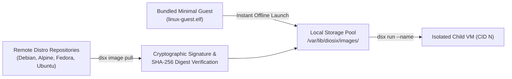

# Diosix live image, installation, and networking plan

This document details the architectural roadmap to transition Diosix from a virtualized development environment into a production-ready, daily-driver Type-1 hypervisor for 64-bit RISC-V (`riscv64`) host hardware.

The design adheres strictly to the **Diosix Security Model**: maintaining a minimal Trusted Computing Base (TCB), enforcing lineage isolation, delegating hardware access using the principle of least privilege, and keeping machine mode (M-mode) free of network protocol parsing.

---

## 1. Architectural principles

Diosix manages Virtual Machines (VMs) hierarchically. The progenitor guest is the **Root VM** (Domain 0), which supervises direct descendant child VMs. The hypervisor core acts as an execution scheduler, memory isolation barrier (via G-stage extended page tables or Physical Memory Protection (PMP)), and Layer-2 virtual Ethernet frame router.

```mermaid
flowchart TD
    subgraph "Host Hardware"
        NIC["Physical Network Controller (Ethernet / Wi-Fi)"]
        STORAGE_HW["Host NVMe / eMMC / SD Storage"]
    end

    subgraph "Diosix Bare-Metal Hypervisor (M-Mode)"
        MMU["G-Stage MMU & PMP Isolation Engine"]
        VSWITCH["Layer-2 Virtual Ethernet Switch (NET_SEND / NET_RECV)"]
    end

    subgraph "Guest VM Lineage Tree"
        ROOT["Root VM (CID 1, Privileged Domain 0)<br/>CLI Management (dsx) • Storage Orchestration"]
        NETVM["Net/Firewall VM (Phase 4 Dedicated Domain)<br/>Hardware Passthrough NIC • NAT / Firewall / DHCP"]
        CHILD1["User VM: Workstation (CID 3, Untrusted)<br/>Debian / Alpine Linux (10.0.3.3)"]
        CHILD2["User VM: Sandboxed App (CID 4, Untrusted)<br/>Isolated Micro-appliance (10.0.3.4)"]
    end

    NIC -->|Phase 1: Root VM Driver / Phase 4: Passthrough| ROOT
    STORAGE_HW -->|Block Storage /dev/vda| ROOT
    ROOT <-->|Virtual Ethernet vNIC (10.0.3.1)| VSWITCH
    NETVM <-->|Virtual Ethernet vNIC (10.0.3.2)| VSWITCH
    CHILD1 <-->|Virtual Ethernet vNIC (10.0.3.3)| VSWITCH
    CHILD2 <-->|Virtual Ethernet vNIC (10.0.3.4)| VSWITCH
```

---

## 2. Phase 1: External networking gateway & internet access

### Architectural overview

Child VMs require outbound Internet Protocol (IP) connectivity to download packages, clone git repositories, and interact with remote services, while remaining network-isolated from unauthorized lateral access.

### Design: Root VM Network Address Translation (NAT) gateway

During Phase 1, the privileged Root VM acts as the IPv4 NAT gateway for all descendant child VMs attached to the virtual network subnet (`10.0.3.0/24`):

1. **In-Hypervisor Layer-2 Switch**:
   - The hypervisor routes raw Ethernet frames between guest Context Identifiers (CIDs) using the `DIOSIX.NET_SEND` (Function ID 16) and `DIOSIX.NET_RECV` (Function ID 17) Supervisor Binary Interface (SBI) hypercalls.
   - The hypervisor does not parse Layer-3 (IP) or Layer-4 (Transmission Control Protocol (TCP) / User Datagram Protocol (UDP)) headers, eliminating network parsing exploits in M-mode.

2. **Root VM Gateway Configuration**:
   - The Root VM enables IPv4 packet forwarding via `sysctl` (`net.ipv4.ip_forward=1`).
   - Netfilter / `iptables` NAT masquerading rules translate outbound traffic from `diosix0` (`10.0.3.0/24`) through the host physical Network Interface Card (NIC) (e.g., `eth0`):
     ```sh
     iptables -t nat -A POSTROUTING -s 10.0.3.0/24 ! -d 10.0.3.0/24 -j MASQUERADE
     iptables -A FORWARD -s 10.0.3.0/24 -j ACCEPT
     iptables -A FORWARD -d 10.0.3.0/24 -m state --state RELATED,ESTABLISHED -j ACCEPT
     ```

3. **Child VM Default Route & Domain Name System (DNS)**:
   - Child VMs automatically configure `10.0.3.1` (the Root VM) as their default gateway:
     ```sh
     ip route add default via 10.0.3.1 dev diosix0
     ```
   - DNS resolvers fallback to standard upstream nameservers (such as `1.1.1.1` and `8.8.8.8`) or local DNS forwarding proxies.

4. **Security Analysis**:
   - Child VMs cannot reach the host's physical network directly; all external packets are NAT-isolated.
   - Child VMs cannot spoof other CIDs because the hypervisor overwrites the source Media Access Control (MAC) address to match the sender's authenticated CID (`02:00:00:00:00:<CID>`).

---

## 3. Phase 2: Universal RISC-V bootable live & installer media

### Target hardware platforms

The live media target standard 64-bit RISC-V Single-Board Computers (SBCs) and development boards:
* **StarFive VisionFive 2** (JH7110 quad-core RV64GC)
* **Milk-V Mars & Milk-V Pioneer** (JH7110 & SG2042 64-core)
* **SiFive HiFive Unmatched & Premier P550** (Freedom U740 & ESWIN EIC7700)
* **Banana Pi BPI-F3** (SpacemiT K1 octa-core)
* **QEMU `virt` Platform** (Reference development platform)

### Boot pipeline

Diosix interfaces cleanly with the standard RISC-V boot flow:

$$\text{ROM / SPL} \longrightarrow \text{OpenSBI (M-mode)} \longrightarrow \text{U-Boot (S-mode) / EDK2 (UEFI)} \longrightarrow \text{Extlinux / EFI Stub} \longrightarrow \text{Diosix Hypervisor} \longrightarrow \text{Root VM}$$

### Disk partition scheme (GUID Partition Table - GPT)

The generated image (`diosix-live-riscv64.img`) employs a hybrid GPT layout compatible with both raw U-Boot SPL offsets and Unified Extensible Firmware Interface (UEFI) firmwares:

| Partition | Label | Filesystem | Typical Size | Description |
| :--- | :--- | :--- | :--- | :--- |
| **Slice 0** | `FIRMWARE` | Raw | 16 MB | Board-specific SPL (`u-boot-spl.bin.normal.out`) and U-Boot FIT image (`u-boot.itb`). |
| **Partition 1** | `ESP` / `BOOT` | FAT32 | 128 MB | EFI System Partition containing `extlinux/extlinux.conf`, `vmdiosix.elf`, and Device Tree Blobs (`.dtb`). |
| **Partition 2** | `DIOSIX_SYS` | ext4 / squashfs | 512 MB | Live Root VM system image (read-only base + volatile tmpfs overlay). |
| **Partition 3** | `DIOSIX_DATA` | ext4 | $\ge 2$ GB | Persistent VM storage pool for guest images (`/var/lib/diosix/images/`), manifests, and persistent disks. |

### Extlinux configuration (`extlinux/extlinux.conf`)

```text
menu title Diosix Hypervisor Boot Menu
timeout 30
default diosix-live

label diosix-live
    menu label Diosix Bare-Metal Hypervisor (Live System)
    kernel /boot/vmdiosix.elf
    fdt /boot/dtbs/current.dtb
    append console=ttyS0,115200 earlycon
```

---

## 4. Phase 3: Text user interface installer (`dsx-install`)

When booting from the live media, the Root VM launches an interactive text installer (`dsx-install`):

```text
+-------------------------------------------------------------+
|               Diosix RISC-V Hypervisor Setup                |
+-------------------------------------------------------------+
|  [1] Live Evaluation (Run entirely in RAM with demo VM)     |
|  [2] Install Diosix to Target Disk (NVMe / eMMC / SD)       |
|  [3] Network & Firewall Setup (Configure NAT / DHCP)        |
|  [4] Shell / Diagnostic Console                             |
+-------------------------------------------------------------+
```

### Installation steps
1. **Target Selection**: Detects available host storage block devices (`/dev/nvme0n1`, `/dev/mmcblk0`, `/dev/sda`).
2. **Partitioning & Formatting**: Creates the standard GPT partition table on the target disk.
3. **Payload Installation**: Writes the hypervisor binary, bootloader files, and Root VM environment to the target partitions.
4. **Volume Initialization**: Seeds the persistent storage partition with standard directories and SSH host keys.

---

## 5. Phase 4: Remote guest OS catalog (`dsx image`)

To support standard Linux distributions alongside custom micro-appliances, the guest management utility (`diosix-ctl` / `dsx`) provides declarative OS image orchestration:



### CLI commands

* `dsx image list-remote`: Queries verified upstream distributions for `riscv64` (e.g., Debian 13 "Trixie", Alpine Linux 3.20, Ubuntu 24.04 LTS).
* `dsx image pull <distro>`: Downloads cloud-init / raw VM images via HTTPS.
* `dsx image verify <image_path>`: Verifies SHA-256 checksums and digital signatures before loading.

### Security verification
All downloaded guest images are verified against embedded root-of-trust signatures before being permitted to execute. Guest VMs run strictly untrusted by default (`hardware trust: no`), confining them to their allotted memory quotas and virtual networking queues.

---

## 6. Phase 5: Hardware disaggregation (`sys-net` & `sys-firewall`)

For maximum security hardening, Phase 5 transitions from Root VM NAT routing to dedicated, hardware-isolated network domains:

1. **PCIe / MMIO Passthrough**: The hypervisor assigns physical Ethernet/Wi-Fi controllers directly to a dedicated `sys-net` VM via stage-2 MMIO mapping hypercalls (`MAP_CHILD_MEM`).
2. **Untrusted Root VM**: The Root VM drops its own hardware trust privilege (`DROP_TRUST`) once the initial domains are spawned, leaving Domain 0 as a pure control-plane coordinator.
3. **Firewall Domain (`sys-firewall`)**: Interposes between `sys-net` and user workstations, enforcing packet filtering rules in an isolated S-mode virtual machine.

---

## 7. Implementation roadmap

| Phase | Description | Key Deliverables | Status |
| :--- | :--- | :--- | :--- |
| **Phase 1** | **External Networking Gateway** | Enable IPv4 forwarding, Netfilter NAT masquerade, and default gateway routing in the Root VM startup service. | **Completed** |
| **Phase 2** | **Live Media Generator Script** | Provide `scripts/make_live_image.sh` to generate bootable hybrid GPT disk images for RISC-V hardware and QEMU. | **Completed** |
| **Phase 3** | **Interactive Installer (`dsx-install`)** | Develop a lightweight TUI / CLI installation wizard for deploying Diosix to internal storage drives. | Scheduled |
| **Phase 4** | **OS Image Catalog (`dsx image`)** | Add remote image querying, downloading, and checksum verification commands to `diosix-ctl`. | Scheduled |
| **Phase 5** | **Dedicated `sys-net` Passthrough** | Implement stage-2 physical device passthrough for dedicated network and firewall guest VMs. | Scheduled |
